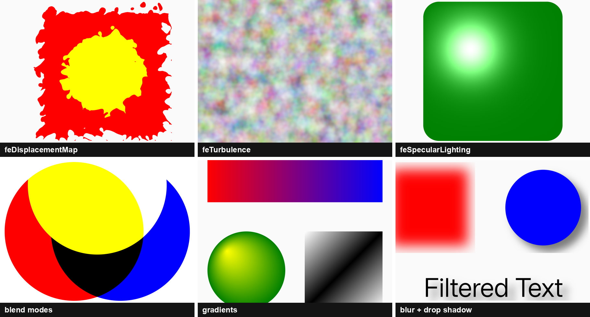

# KSVG

[](https://github.com/oraveczandrew/ksvg/actions/workflows/ci.yml)
[](https://central.sonatype.com/artifact/hu.oandras.ksvg/ksvg)
[](https://github.com/oraveczandrew/ksvg/releases)
[](http://www.apache.org/licenses/LICENSE-2.0)

**KSVG is a modern, standards-focused SVG renderer for Android.** It started as an evolution of the original [AndroidSVG](https://github.com/BigBadaboom/androidsvg) library and has grown into a substantially expanded renderer with broad SVG feature coverage, GPU-accelerated filtering, native SIMD kernels, animation, and modern typography support.



Try it yourself: the showcase app is downloadable from the [releases page](https://github.com/oraveczandrew/ksvg/releases).

The public API and rendering core are written in Kotlin; filters run through a GPU pipeline on API 33+ (AGSL shaders; `RenderEffect` chain on API 31+) with automatic decline to the CPU software path, backed by a native SIMD engine (x86_64/x86 SSSE3 baselines with AVX2 rows; ARMv7/ARM64 NEON) and a pure-Kotlin CPU fallback (parity-gated against the native kernels, with documented ±1 LSB per-kernel tolerances).

*KSVG is licensed under the [Apache License v2.0](http://www.apache.org/licenses/LICENSE-2.0)*.

## Why KSVG?

- **Broad SVG feature coverage**: filters, masking, clipping, gradients, animations, and modern typography — see the [feature support matrix](docs/SVG-SUPPORT.md).
- **GPU-accelerated filtering** with automatic fallback to the CPU software path; `RenderOptions.softwareFiltering(true)` forces deterministic software rendering.
- **Native SIMD filter engine** (x86_64/x86 SSSE3 baselines with AVX2 rows; ARMv7/ARM64 NEON) with a pure-Kotlin fallback (parity-gated, documented ±1 LSB per-kernel tolerances) — see the [benchmarks](docs/BENCHMARKS.md).
- **Declarative SMIL animations**: `<animate>`, `<animateTransform>`, `<animateColor>`.
- **Modern typography**: variable fonts (`font-variation-settings`) and OpenType features (`font-feature-settings`).
- **Easy integration**: optional Glide and Jetpack Compose artifacts; immutable DOM with object pooling to keep GC pressure low.

## Feature Support

KSVG provides broad SVG 1.1 and modern SVG feature coverage, including filters, masking, clipping, gradients, SMIL animation, and modern typography.

See the full [SVG feature support matrix](docs/SVG-SUPPORT.md).

## Installation

```kotlin
dependencies {
    implementation("hu.oandras.ksvg:ksvg:1.0.0-beta02")
    // Optional Glide integration:
    implementation("hu.oandras.ksvg:glide:1.0.0-beta02")
    // Optional Jetpack Compose integration:
    implementation("hu.oandras.ksvg:compose:1.0.0-beta02")
}
```

Requires Kotlin 2.4+ on the consumer side (the library ships 2.4 metadata).

## Basic Usage

Rendering an SVG to a Canvas:

```kotlin
val svg = SVG.getFromAsset(assets, "sample.svg")
val canvas = Canvas(bitmap)
svg.renderToCanvas(canvas)
```

Showing an SVG in an `ImageView` (static or animated):

```kotlin
val svg = SVG.getFromAsset(assets, "sample.svg", parseAnimations = true)
imageView.setImageDrawable(svg.toAnimatedDrawable())
```

Or directly from assets with `KSVGImageView`:

```kotlin
ksvgImageView.setImageAsset("sample.svg")
```

Loading through Glide (add the `glide` artifact; `KSVGGlideModule` registers itself):

```kotlin
Glide.with(context)
    .asDrawable()
    .set(KSVGOptions.PARSE_ANIMATIONS, true)
    .load(uri)
    .into(imageView)
```

Showing an SVG in Jetpack Compose (add the `compose` artifact):

```kotlin
KsvgImage(
    assetPath = "sample.svg",
    contentDescription = null,
    modifier = Modifier.size(96.dp),
)
```

For animated SVGs (SMIL), use `KsvgAnimatedImage` (parses with `parseAnimations = true`), or `KsvgCanvas` for direct canvas rendering without an intermediate `Drawable`.

For more advanced usage, including `RenderOptions` (custom CSS, viewPorts, target
element rendering, `softwareFiltering(true)` for deterministic CPU rendering),
see the `RenderOptions` documentation.

## KSVG vs. AndroidSVG Comparison

| Feature                 | AndroidSVG (Original) | KSVG                                         |
|:------------------------|:----------------------|:---------------------------------------------|
| **Language**            | Java                  | 100% Kotlin                                  |
| **Style State**         | Mutable Objects       | **Immutable** (Memory Optimized)             |
| **Memory Management**   | Standard Allocation   | **Object Pooling** (`PoolOwner`)             |
| **SVG Filters**         | Limited               | **Comprehensive** (Most Primitives)          |
| **SVG Animations**      | Not Supported         | **Supported** (`animate`, `transform`, etc.) |
| **Variable Fonts**      | Not Supported         | **Supported** (`font-variation-settings`)    |
| **Font Features**       | Not Supported         | **Supported** (`font-feature-settings`)      |
| **Modern Graphics API** | PorterDuff only       | PorterDuff + **BlendMode** (API 29+)         |
| **GC Pressure**         | Regular               | **Reduced** (Object Pooling)                 |

## Modules

| Module       | Artifact                                 | Description                                                                         |
|:-------------|:-----------------------------------------|:------------------------------------------------------------------------------------|
| `:ksvg`      | `hu.oandras.ksvg:ksvg`                   | Parser, DOM, renderer, public API                                                   |
| `:filtering` | `hu.oandras.ksvg:filtering` (transitive) | Native + Kotlin filter kernels                                                      |
| `:glide`     | `hu.oandras.ksvg:glide`                  | Glide integration (optional)                                                        |
| `:compose`   | `hu.oandras.ksvg:compose`                | Jetpack Compose integration (optional)                                              |
| `:showcase`  | — (demo app, not published)              | Sample application ([download APK](https://github.com/oraveczandrew/ksvg/releases)) |

## Documentation

API reference (Dokka) at [oraveczandrew.github.io/ksvg](https://oraveczandrew.github.io/ksvg/).

Design and validation notes:

- [SVG feature support matrix](docs/SVG-SUPPORT.md)
- [Rendering and filter architecture](docs/RENDERING_FILTERING.md)
- [Chrome SVG filter usage analysis](docs/SVG_FILTER_USAGE.md)
- [Benchmarks](docs/BENCHMARKS.md)
- [Known limitations](docs/KNOWN_ISSUES.md)

## Contributing

### Find a bug?
Please file a [bug report](https://github.com/oraveczandrew/ksvg/issues) and include as much detail as you can. If possible, include a sample SVG file showing the error.

### Feedback
If you wish to contact the author with feedback on this project, you can email me at [info@oandras.hu](mailto:info@oandras.hu).

